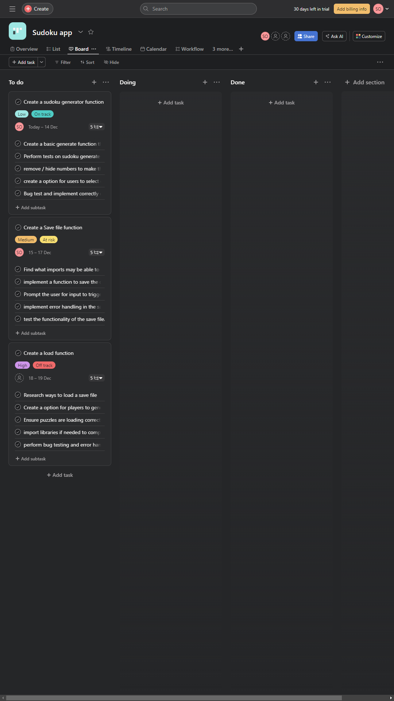

#  T1A3 - Terminal Application

### Sam's Sudoku Puzzler

 
 

<a href="https://github.com/StructuredTrading/T1A3_TERMINAL_SUDOKU_APP"> Link to Github Repository</a>

## Project Information

Sam's Sudoku Puzzler App is a python-based application that allows users to play Sudoku puzzles. It provides an interactive interface for solving Sudoku puzzles and offers features like puzzle generation, saving and loading game states, and more.

## Code Style Guide

This project follows the Python style conventions outlined in PEP8.

## Features

- Interactive Sudoku Grid:
  - The app provides an interactive 9x9 Sudoku grid for users to input their answers.
- Puzzle generation: 
  - Users can generate new Sudoku puzzles with varying degree of difficulty levels by choosing a number between 5 and 60. (This numbe represents the amount of numbers to solve on the grid.)
- Save and Load Game:
  - Save the current state of a Sudoku game and load it later to continue playing.
- User-Friendly Interface:
  - Intuitive design for a seamless user experience. 
  

## Implementation Plan

### Overview

As part of the development process for the Sudoku Puzzler App, I leveraged the Asana project management tool to streamline implimentation of different features and keep on track for deadlines of implimentation and development.

</img>

#### Sudoku Puzzle Generation
