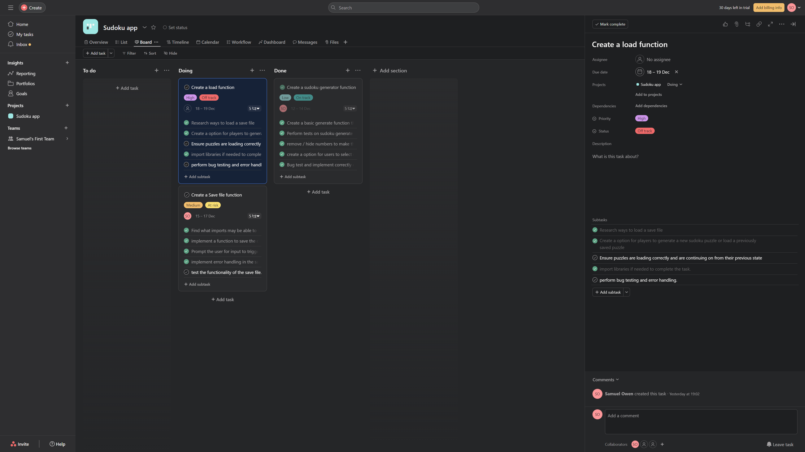

#  T1A3 - Terminal Application

### Sam's Sudoku Puzzler

 
 

<a href="https://github.com/StructuredTrading/T1A3_TERMINAL_SUDOKU_APP">Github Repository</a>

<a href="https://app.asana.com/0/1206149212914837/1206149212914837">Asana Project Management</a>

## Project Information

Sam's Sudoku Puzzler App is a python-based application that allows users to play Sudoku puzzles. It provides an interactive interface for solving Sudoku puzzles and offers features like puzzle generation, saving and loading game states, and more.

 

## Code Style Guide

This project follows the Python style conventions outlined in <a href="https://peps.python.org/pep-0008/">PEP8</a>. 

PEP 8 is a style guide for Python code, and adherence to its conventions improves code readability and maintainability. Here are five basic rules from PEP 8 and how they are applied in the context of the Sudoku Puzzler App project:

- Indentation (Rule: Use 4 Spaces per Indentation Level):
  - each level of indentation in the Sudoku Puzzler App project is set to four spaces. This consistent indentation style is applied throughout the codebase for better readability.

- Maximum Line Length (Rule: Limit All Lines to 79 Characters for Code):
  - Lines of code in the Sudoku Puzzler App are limited to 79 characters to ensure readability. Longer lines are broken using backslashes.

- Imports (Rule: Imports Should Usually Be on Separate Lines):
  - Import statements are organized with standard library imports first, followed by third-party and local imports. Each group is separated by a blank line.

- Whitespace in Expressions and Statements (Rule: Avoid Extraneous Whitespace):
  - The Sudoku Puzzler App project adheres to the guidelines of avoiding unnecessary whitespace in expressions, parentheses, and other syntax elements.

- Function and Variable Naming (Rule: Function Names Should Be Lowercase, With Words Separated by Underscores):
  - Function and variable names are consistently named in lowercase with underscores for improved readability.

 

## Features

- Interactive Sudoku Grid:
  - The app provides an interactive 9x9 Sudoku grid for users to input their answers.
- Puzzle generation: 
  - Users can generate new Sudoku puzzles with varying degree of difficulty levels by choosing a number between 5 and 60. (This numbe represents the amount of numbers to solve on the grid.)
- Save and Load Game:
  - Save the current state of a Sudoku game and load it later to continue playing.
- User-Friendly Interface:
  - Intuitive design for a seamless user experience. 
  
 

## Implementation Plan

### Overview

As part of the development process for the Sudoku Puzzler App, I leveraged the Asana project management tool to streamline implimentation of different features and keep on track for deadlines of implimentation and development.

The implimentation plan was to break down each feature:
- Generate Random Sudoku Puzzles.
  - Create a basic generate function that creates a 9 X 9 grid of numbers 1-9
  - Perform tests on sudoku generate function to confirm puzzles are valid numbers
  - remove / hide numbers to make the puzzle playable
  - create a option for users to select difficulty or how many numbers to solve in puzzle
  - Bug test and implement correctly error handling
  
 

- Create a Save File Function.
  - Find what imports may be able to help with creating a save file
  - implement a function to save the current state of the sudoku game to a file
  - Prompt the user for input to trigger the save function (eg choosing to quit the game)
  - implement error handling in the save function to manage any issues that may arise.
  - test the functionality of the save file.
  
 

- Create a Load File Function.
  - Research ways to load a save file
  - Create a option for players to generate a new sudoku puzzle or load a previously saved puzzle
  - Ensure puzzles are loading correctly and are continuing on from their previous state
  - import libraries if needed to complete the task.
  - perform bug testing and error handling.

 

The list of features ready to be implimented:

</img>

 

### Create a Sudoku Random Generator Function.

The goal of implementing the Sudoku random generator function is to create a random 9x9 Sudoku puzzle with varying levels of difficulty. This function is crucial for providing users with a diverse and enjoyable puzzle-solving experience.

</img>

</img>

</img>

 

### Create a Save File Function.

The Save File function is responsible for saving the current state of the Sudoku game, including the filled-in numbers and the user's progress. This saved data is then stored in a file, format called pickle. Each save is unuqie using the username given by the users with the "_save" and the ".pickle" extention.

</img>

</img>

</img>

 

#### Create a Load File Function.

The Load File function is designed to read a saved ".pickle" file, of the data, and restore the game state. It allows users to pick up where they left off by loading their saved Sudoku game.

</img>

</img>

 

## Sam's Sudoku Puzzler App Help Documentation